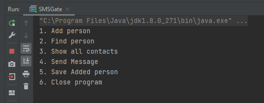

# SMS Gate
> Program for sending SMS via SMSApi

## Table of contents
* [General info](#general-info)
* [Screenshots](#screenshots)
* [Technologies](#technologies)
* [Setup](#setup)
* [Features](#features)
* [Status](#status)
* [Inspiration](#inspiration)
* [Contact](#contact)

## General info
Motivation to create this small program was to test how the SMSAPI support functions. 
The goal was to create it in console mode without any interface. Plain program.

## Screenshots

## Technologies
* SMSAPI 2.4
* OpenCSV 4.1
* Java 8

## Setup
1. Register on SMSAPI website `https://www.smsapi.pl/` to obtain a username and password.
2. Fill the credentials under class `SMSSender`.
3. Just run `mnv install` to compile the software.

## Features
List of features:
* Sending SMS via SMSAPI
* Read/Write phone book as a .csv file
* Validation of phone number

To-do list:
* None

## Status
Project is: _finished_.

## Inspiration
Project inspired by testing purposes.

## Contact
Created by [@AdamSobieraj](https://github.com/AdamSobieraj) - feel free to contact me!